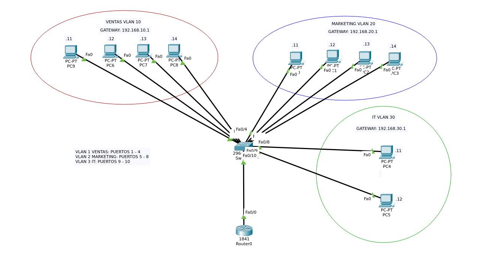

# Practica 01: Segmentacion de Red Empresarial mediante VLANs y Enrutamiento Router-on-a-Stick

## Caso de Estudio
Una empresa requiere estructurar su red local corporativa para aislar el trafico entre sus diferentes departamentos y mejorar la seguridad. La infraestructura necesita segmentar las estaciones de trabajo en tres departamentos principales: **Ventas**, **Marketing** y **Tecnologias de la Informacion (IT)**.

Para cumplir con este requerimiento, se implemento una arquitectura basada en VLANs (IEEE 802.1Q) sobre un switch Cisco 2960 y un router Cisco 1841 en modalidad Router-on-a-Stick. Asimismo, el router actua como servidor DHCP centralizado, excluyendo las direcciones fijas reservadas para la infraestructura de red.

---

## Diagrama de la Topologia



---

## Tabla de Segmentacion y Direccionamiento

| VLAN | Departamento | Puertos Switch | Subinterfaz Router | Red | IP Gateway | Rango Excluido DHCP |
| :--- | :--- | :--- | :--- | :--- | :--- | :--- |
| **10** | Ventas | FastEthernet0/1 - 0/4 | FastEthernet0/0.10 | `192.168.10.0/24` | `192.168.10.1` | `192.168.10.1 - 192.168.10.10` |
| **20** | Marketing | FastEthernet0/5 - 0/8 | FastEthernet0/0.20 | `192.168.20.0/24` | `192.168.20.1` | `192.168.20.1 - 192.168.20.10` |
| **30** | IT | FastEthernet0/9 - 0/10 | FastEthernet0/0.30 | `192.168.30.0/24` | `192.168.30.1` | `192.168.30.1 - 192.168.30.10` |

---

## Configuracion de Equipos

### 1. Configuracion del Switch (Creacion de VLANs, Acceso y Enlace Troncal)

```text
! Creacion de VLANs
Switch# configure terminal
Switch(config)# vlan 10
Switch(config-vlan)# name VENTAS
Switch(config-vlan)# vlan 20
Switch(config-vlan)# name MARKETING
Switch(config-vlan)# vlan 30
Switch(config-vlan)# name IT
Switch(config-vlan)# exit

! Asignacion de puertos de acceso
Switch(config)# interface range FastEthernet0/1 - 4
Switch(config-if-range)# switchport mode access
Switch(config-if-range)# switchport access vlan 10

Switch(config)# interface range FastEthernet0/5 - 8
Switch(config-if-range)# switchport mode access
Switch(config-if-range)# switchport access vlan 20

Switch(config)# interface range FastEthernet0/9 - 10
Switch(config-if-range)# switchport mode access
Switch(config-if-range)# switchport access vlan 30

! Configurar puerto de enlace troncal hacia el router
Switch(config)# interface FastEthernet0/24
Switch(config-if)# switchport mode trunk
Switch(config-if)# end
